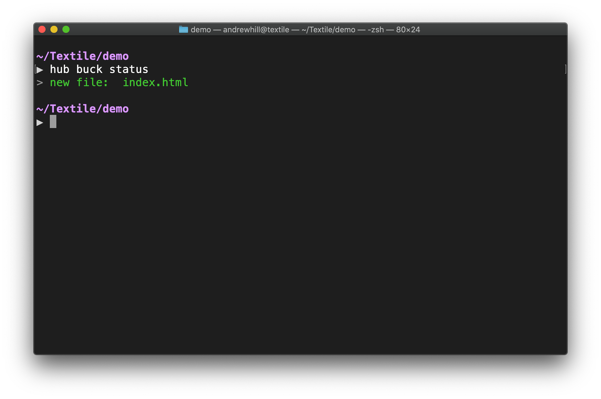
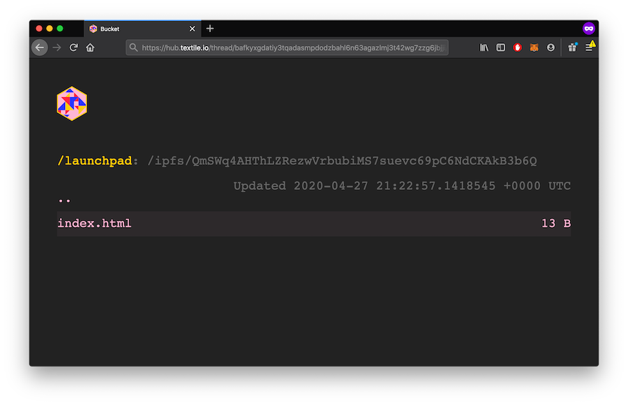
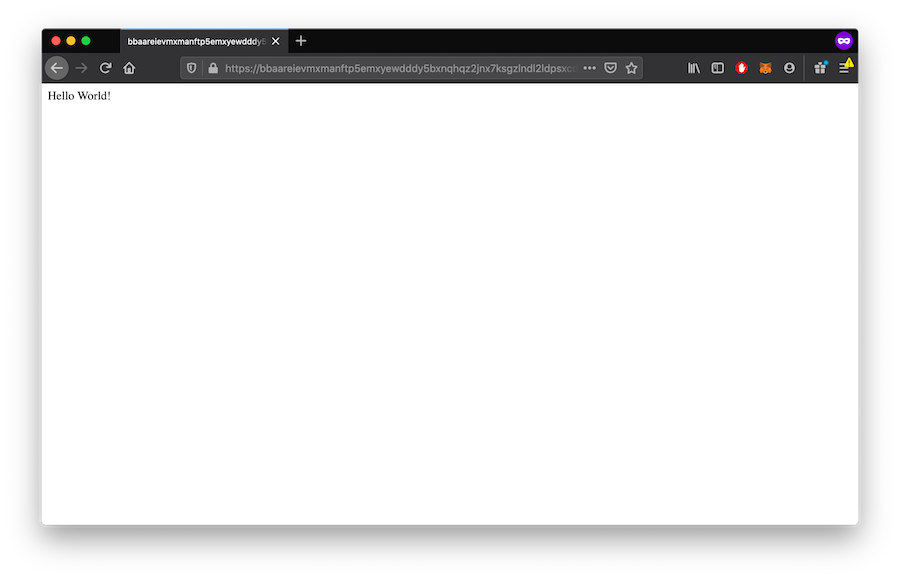
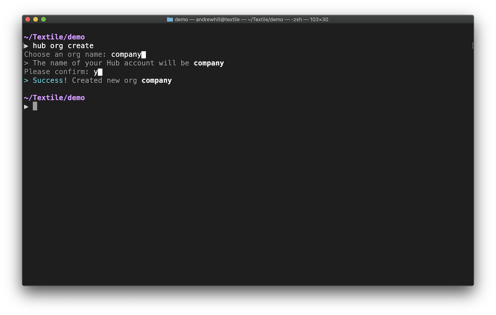

# Buckets

## Getting Started

If you've used cloud storage before, you'll find buckets easy to understand. Unlike traditional cloud services, buckets are built on open, decentralized protocols including the IPFS and Libp2p. You can serve websites, data, and apps from buckets.

Buckets are packed with useful features, including:

- Explore your Buckets on the [Hub gateway](#explore-on-the-gateway).
- Render web content in your Bucket on a persistent [website](#render-on-a-website).
- Automatically distribute your updates [on IPFS using IPNS](#render-on-ipfs-gateways).
- Collaboratively manage Buckets as an [organization](#organization-buckets).
- Create private Buckets where your [app users can store data](#app-user-buckets).
- (Soon) Archive Bucket data on Filecoin to ensure long-term security and access to your files.

## Initialize a Bucket

When working on your local machine, buckets are mapped to working directories. Once you initialize a bucket in a directory, anytime you return to the directory, the [Textile CLI](../hub/cli/hub.md) will automatically detect the Bucket you are interacting with. To start a Bucket in your current working directory, you must first initialize the Bucket. You can initialize a bucket with an existing UnixFS DAG available in the IPFS network, or import it interactively in an already existing bucket.

.](../images/hub-cli/hub_bucket_init.png)

!!! info
    Bucket names are unique to a developer and within an Org. They are not globally unique.

!!! warning
    Be careful creating a bucket in a root directory, because all children directories are linked to that bucket. To move or remove a bucket's link to a directory, edit, move or delete the `.textile/config.yml` file (it will be a hidden folder in the bucket's directory)

### Shared buckets

You can create buckets to share with all members of an organization. To do so, simply initialize an Org first and then initialize a Bucket using the `--org` flag, specifying the name of the Org you want to share the bucket with. For example `hub bucket init --org nasa`. All members of the Org will be able to push and pull files to and from the shared Bucket. [Read more about creating Orgs](../hub/accounts.md#organizations).

!!! info
    to check which org a bucket is registered with, examine the `.textile/config.yml` file (it will be a hidden folder in the bucket's directory)

## Encrypted buckets

It is possible to create encrypted buckets. The contents of encrypted buckets _will_ still exist on IPFS but the contents will be obfuscated to any viewer that doesn't have access to the encryption keys. You can choose to create encrypted buckets in when creating them in the CLI or when initializing them [in the JavaScript library](../tutorials/hub/user-buckets.md#push-encrypted-buckets).

## Publishing content

### Push new files

.](../images/hub-cli/hub_bucket_push.png)

`hub bucket push`

### Diffing and Synching

When a bucket is pushed to the remote, its [Merkle DAG](https://en.wikipedia.org/wiki/Merkle_tree) representation is saved locally as a reference of the latest pushed version. When you execute `hub buck status`, it compares the persisted Merkle DAG with a generated Merkle DAG of the Bucket local state. As we mentioned in the last section, walking both DAGs and comparing [CIDs](https://github.com/multiformats/cid) can quickly provide paths that changed to the last known version. In a nutshell, when a bucket is pushed, the persisted Merkle DAG contains the minimum amount of information about the directory structure and data fingerprints. [Read more about this process](https://blog.textile.io/buckets-diffing-syncing-archiving/).



### Encryption

On bucket creation, you can opt-in to encrypt buckets content. The encryption setup is based on AES-CTR + AES-512 HMAC as seen [here](https://github.com/textileio/dcrypto), a modified version of the encryption lib used by the Google Drive client, which is designed to handle large streams (files).

Encrypted buckets have a couple goals:
- Obfuscate bucket data / files (the normal goal of encryption)
- Obfuscate directory structure, which amounts to encrypting IPLD nodes and their links

The AES and HMAC keys used for bucket encryption are stored in the threadDB collection instance. That just means, each bucket has a model entry for key. This setup essentially allows bucket access to be inherited by thread ACL rules. Of course, this also means that if you can break into the thread (you have gained access to the thread read key), you can decrypt bucket content.

As a compromise, we have added some convenience methods to the local buck client which allow you to encrypt content locally (protected by a password) before it gets added to the bucket. This has the downside that you must remember the password.

Finally, you can run the standalone buckets daemon buckd locally and use a remote peer as a thread replicator (no read key access), meaning there’s really no downside to the keys being stored in the bucket collection instance.
Password-based encryption uses the same approach, but also leverages [scrypt](https://godoc.org/golang.org/x/crypto/scrypt) to derive the keys from the password. This carries the normal tradeoff: The encryption is only as good as the password.

## Retrieving content

### Pull files

`hub bucket init --existing`

!!!info
    By using the `--existing` flag, you can list buckets already pushed by you or, when using `--org`, your collaborators.

### Explore on the gateway

To inspect your pushed files, explore on the gateway:
`hub bucket links`
then open the first result 'Thread links' in your browser.



The Hub gateway gives you a static URL where you can explore, download, and share your latest Bucket content.

### Render on a website



If your Bucket contains web content, the Bucket website endpoint will provide you a static URL that will always render the latest content from your Bucket. [See HTTP Domains](#http-domain).

### Render on IPFS gateways

Buckets are dynamic folders distributed over IPFS using ThreadDB. Each time you **create** a new Bucket, you will receive a new [IPNS Address](#ipns-address) that you can use on the IPFS address to fetch the latest Bucket content. The IPNS address will not change, but the content will update each time you push changes to your Bucket. Each time you **update** your Bucket, you will receive a new IPFS address to fetch that version of your Bucket content.

### HTTP Domain

All public Buckets are automatically provided a subdomain on `textile.space` that will reflect the latest changes in to your Bucket. Your Bucket's IPNS address is used as the subdomain, such that your Bucket URL will always be: `<ipns-address>.textile.space`. This is designed to further enhance the interoperability of protocols using Textile Buckets.

### IPNS Address

Each Bucket has a unique [IPNS](https://docs.ipfs.io/guides/concepts/ipns/) address that will allow you to render or fetch your Bucket on any IPFS peer or gateway that supports IPNS (including [ipfs.io](https://ipfs.io) and [Cloudflare](https://cloudflare.com)).

Buckets can't change the speed of IPNS propagation through the network, but we recommend you explore and try for yourself. The [Hub gateway](#explore-on-the-gateway) will always render the latest data right away.

## Bucket Automation (CI/CD)

Buckets are an ideal tool for persisting your website, source code, or documentation on IPFS using continuous integration. Tools like Travis CI, CircleCI, and GitHub Actions all make it possible to do very easily.

We have provided a configurable [GitHub Action](https://github.com/marketplace/actions/textile-buckets) that allows you to:

* Push or update your Bucket based on pull requests, commits, and merges.
* Generate IPNS, IPFS, and HTTP addresses for every Bucket creation or update.
* Create temporary Buckets for staging or review that can be removed automatically when content is merged or pull requests are closed.

](../images/buckets/github-action.png)

## Learn more

### Bucket Permissions

#### Developer Buckets

All buckets you create are scoped to your developer account. You can always find your currently logged in account with `hub whoami`.

#### Organization Buckets

Any buckets you create using the `--org` flag will also be shared with Org members. Here are the steps to create an Org, create a new Bucket in the Org, and invite a collaborator to the Org:

##### Create a new Org



```bash
hub org create
Choose an Org name: nasa█
> The name of your account on Textile will be nasa
> Your URL will be http://hub.textile.io/nasa
Please confirm: y█
> Success! Created new org nasa with URL http://hub.textile.io/nasa
```

You have now created the `nasa` Org.

##### Create a new Bucket shared with an Org

The default bucket command is simply `buck`, because it's two letters less to type each time. If you prefer, you can still type `bucket`

```bash
mkdir launchpad
cd launchpad
hub buck init --org nasa
```

You have now created a new Bucket inside of the `launchpad` directory and owned by your `nasa` organization.

##### Invite a collaborator

```bash
hub org invite
```

The final step is to invite collaborators to your Org. Once they accept the invite, they will be able to interact with buckets associated with the Org.

#### App user Buckets

If you are building an app using one of our [developer libraries](../hub/app-apis.md#libraries) you can use buckets from inside your apps. Apps generally will create buckets on behalf of each user, meaning the user should retain control of the Bucket metadata and contents.

<div class="txtl-options">
  <a href="../tutorials/hub/user-buckets/" class="box">
    <h5>Buckets in your app</h5>
    <p>View the tutorial on adding Buckets to your JavaScript app.</p>
  </a>
  <span class="box-space"> </span>
  <a href="https://textileio.github.io/js-hub" target="_blank" class="box">
    <h5>JS Hub Docs</h5>
    <p>Persist user buckets on IPFS from your JS app.</p>
  </a>
  <span class="box-space"> </span>
  <a href="../tutorials/react-native-buckets/" class="box">
    <h5>React Native tutorial</h5>
    <p>See how to create user buckets & threads in React Native.</p>
  </a>
</div>

### Bucket Protocols

Buckets are designed to be interoperable across protocols and services. Here are a few examples.

#### Buckets and Threads

Buckets are built on [ThreadDB](../threads/index.md). In fact, in their most basic form, buckets are just a document in a Thread that is updated each time the directory of data is updated. Since buckets run on Threads, it opens the door to many new integrations that can be built on Buckets!

#### Buckets and HTTP

Buckets can be rendered over HTTP through either the [Hub Gateway](#explore-on-the-gateway), the [Bucket subdomains](#render-on-a-website), or on any IPFS gateway supporting IPNS (see below).

#### Buckets and IPFS

Data in a Bucket is stored as IPLD and pinned on IPFS. You can use the underlying content addresses to pin new Bucket content on additional pinning services such as [Pinata](https://pinata.cloud) or [Infura](https://infura.io/). This can be useful if you want additinal replication of your content on the IPFS network.

#### Buckets and IPNS

Every Bucket you create has a unique ID associated with it. The Bucket ID is an [IPNS](https://docs.ipfs.io/guides/concepts/ipns/) address that you can also use to fetch the latest Bucket content from any IPFS peer or view it over IPFS gateways that support the IPNS protocol.

### More resources

<div class="txtl-options">
  <a href="../../hub/cli/hub" class="box">
    <h5>Textile Hub CLI</h5>
    <p>Read the full CLI documentation.</p>
  </a>
  <span class="box-space"> </span>
  <a href="https://textileio.github.io/js-hub" target="_blank" class="box">
    <h5>Textile JavaScript SDK</h5>
    <p>Persist Buckets on IPFS from your JavaScript app.</p>
  </a>
  <span class="box-space"> </span>
  <a href="https://github.com/marketplace/actions/textile-buckets" target="_blank" class="box">
    <h5>GitHub Action for Buckets</h5>
    <p>Push and updates from your GitHub repos.</p>
  </a>
</div>
