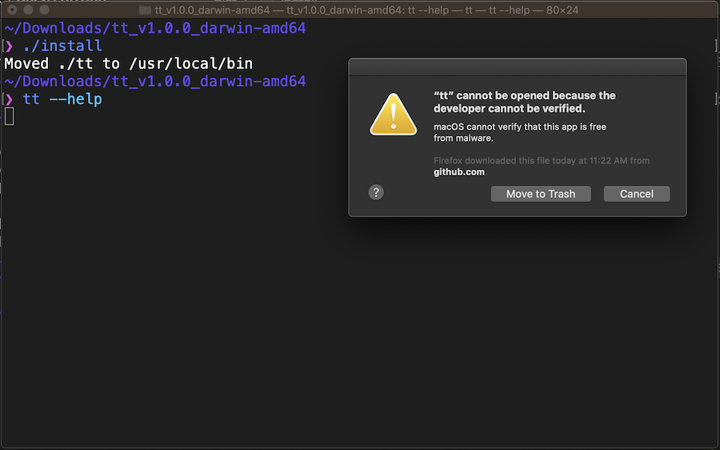
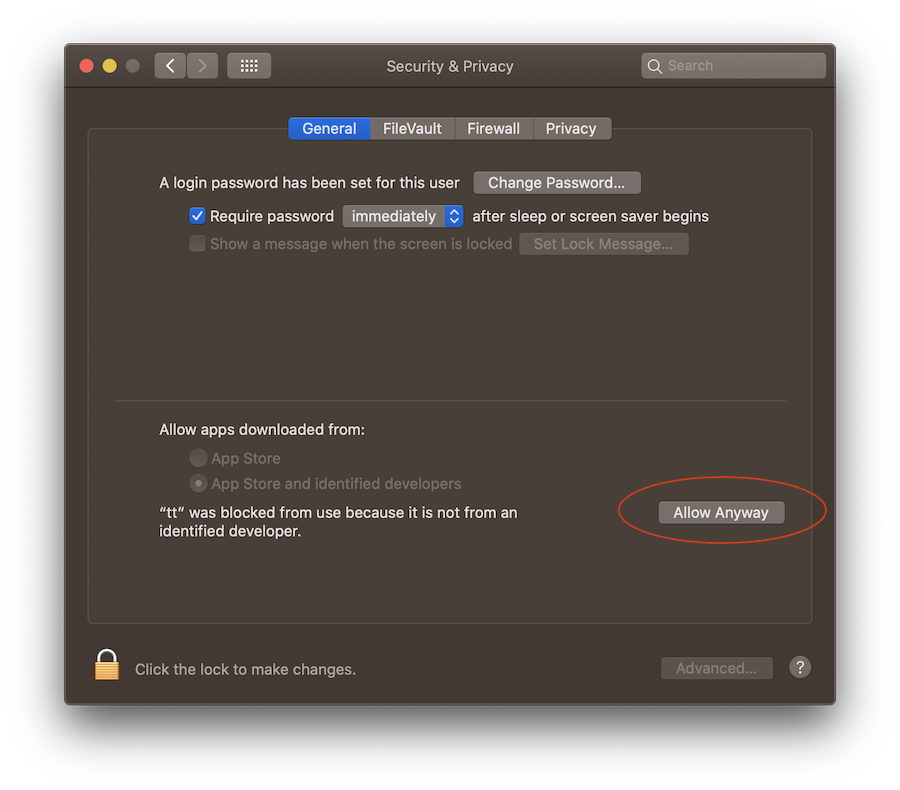
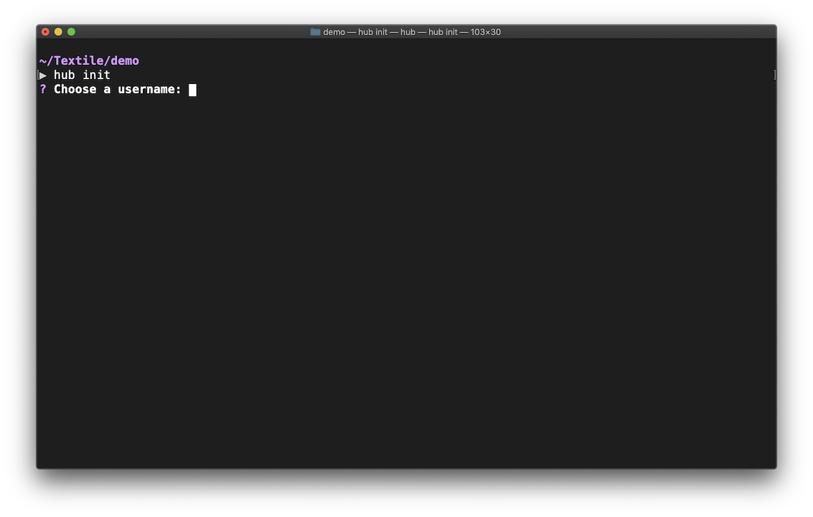

# Getting Started

## Installation

### Download

To access and manage Hub resources, you need to install the Hub CLI. First, download the Hub CLI binary for your platform from the [latest releases](https://github.com/textileio/textile/releases/latest).

!!! info
  
    You'll see two binaries available for download on the Textile releases page, `hub` and `buck`. You can ignore the `buck` binary for now; It's used to interact with Buckets in a stand-alone manner, independent of Textile Hub. For our purposes here, `hub` provides all the functionality you'll need to interact with the Textile Hub and Buckets.

### Install


#### Mac Installation

On MacOS you will need to confirm that it is okay to run the `hub` binary before it will run successfully. You will see this warning:






You will now be able to continue using the CLI without issue. When you update the binary, you may need to repeat the above steps. We will add developer signing to our MacOS binaries soon.


## Account setup

### Initialize



To start using remote services such as IPFS pinning, Bucket sharing, and Thread APIs, you need an account on the Hub. Textile provides a simple, password-less account setup. You can create a new account and username with just an email address.

```sh
hub init
```

### Whoami

You can always verify that you have an active session on the Hub and that you are using the correct account by running the `hub whoami` command.

### Login

If you've just initialized your account successfully, there is no need to login. However, if you are returning to the Hub and need to re-login, simply use the login command.

```sh
hub login
```

## Organizations

The Hub allows you to create organizations easily. Organizations can be one or many collaborators. Members of an Org have management access to the [Buckets](../buckets/index.md) and [App Keys](../hub/app-apis.md#app-keys) created while in an Org's directory.

!!! info
  
    You can [create](../hub/cli/hub_orgs_create.md), [invite](../hub/cli/hub_orgs_invite.md), and [leave](../hub/cli/hub_orgs_leave.md) organizations easily. Read more about all Org methods on the [CLI docs](../hub/cli/hub_orgs.md).

To learn more about sharing Buckets with an organization, read the intro on [Organization Buckets](../buckets/index.md#organization-buckets).

### Enterprise users

If you are interested in enterprise support from Textile, please email us at [support@textile.io](mailto:support@textile.io).
