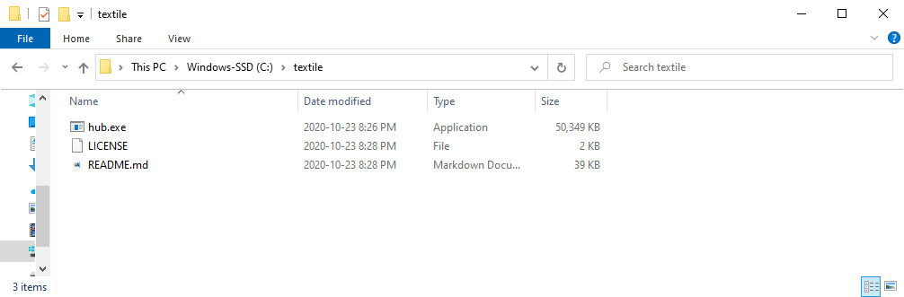
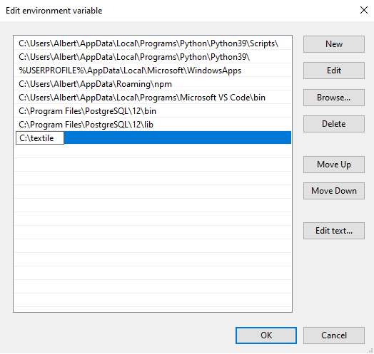

# Installation and Account Setup

To create an account, you first need to install the Hub CLI. The CLI is where you manage accounts, create orgs, create API keys, etc. 

The first step is to download and install the application.

## Download the Hub CLI Binary

Download the Hub CLI binary from the release landing page: [https://github.com/textileio/textile/releases/latest](https://github.com/textileio/textile/releases/latest).

You'll see four different options - `buckd`, `buck`, `hubd`, and `hub`. 

`hub` is the option you need. It provides all the functionality you'll need to interact with the Textile Hub and Buckets. 

You'll also see different operating systems. Select the one that matches your computer.

Next, follow the installation instructions based on your operating system.

## Mac Installation

Open the contents of the downloaded archive and run the `install` script. This should install the `hub` tool on your computer. You can verify with `hub --help


On MacOS you will need to confirm that it is okay to run the `hub` binary before it runs successfully. You will see this warning:


Select 'Cancel.' 

Go to 'System Settings' => 'General' where you will be able to click, 'Allow Anyway.'


Run `hub --help` again and this time select, 'Open` when prompted.


You will now be able to continue using the CLI without issue. When you update the binary, you may need to repeat the above steps. We will add developer signing to our MacOS binaries soon.


## Windows Installation

The Windows Hub CLI binary comes with a `hub.exe` that runs `hub` commands. 

You can use [Powershell](https://docs.microsoft.com/en-us/powershell/) to work with the hub CLI by running the executable directly in your terminal like below.


This method requires you to work in the same directory as `hub.exe`.

Another option is to add `hub.exe` to the PATH environment variable to access the `hub` command globally.

### Adding hub.exe to the Path Environment Variable

Rename the directory and place it in an accessible location like the `C:\` directory.



Open your environment variables option by typing in 'Environment variables' in the Windows start menu and select the first option.


Select 'Environment Variables' at the bottom.


Select the 'Path' option from User variables if you want to have the hub CLI available only to the current user, or from System variables if you want the hub CLI available for the whole system.

After 'Path' is selected, click 'Edit.'


In the 'Edit environment variables' window, select 'New' and enter the location of your hub directory.



Click 'OK' to close all the windows.

Open up a new terminal instance and you should be able to run the `hub` command without being in the same directory as the executable.


## Account setup

The next step is to initialize an account. The Hub CLI use magic-link signin, so it only requires you to enter and verify a valid email.

### Initialize


```sh
hub init
```

You have now created an account on the Textile Hub! You can now run all the available commands, such as `hub --help`, `hub whoami`, `hub buckets`, `hub keys ls`, `hub logout`, and `hub login`.

### Login

Now that your account exists, the next time you use the CLI on a new computer, or after logging out, you simply need to `login`.

```sh
hub login
```

## Organizations

`Orgs` allow multiple developers to work together using shared resources. Members of an organization can collaboratively manage, create, or remove [API keys](../hub/apis.md#app-keys), and more.

You can create an `org` easily.


```sh
hub org create
```

Next, you can begin inviting collaborators by email addresses.


```sh
hub org invite
```

You can now share and collaborate with all `org` members. For example, when creating new buckets, you can create them in the `org` and immediately be available to your collaborators. Additionally, you can create and share API key admin.

**Org bucket init**

```sh
HUB_ORG=<org name> hub buck init
```

**Org keys create**

```sh
HUB_ORG=<org name> hub keys create
```

!!!info
    You can [create](../hub/cli/hub_orgs_create.md), [invite](../hub/cli/hub_orgs_invite.md), and [leave](../hub/cli/hub_orgs_leave.md) organizations easily. Read more about all Org methods on the [CLI docs](../hub/cli/hub_orgs.md).

To learn more about sharing Buckets with an organization, read the intro on [Organization Buckets](../buckets/index.md#organization-buckets).

## Enterprise users

If you are interested in enterprise support from Textile, please email us at [support@textile.io](mailto:support@textile.io).

## Account deletion

If you delete your account or organization, data replicated on IPFS through any API will **also be removed**. So if you remove your account, we highly encourage you to replicate the data on an external IPFS node, provide tools for your users to export or replicate their account data, or host external Thread Services to migrate your user Thread replication to.
