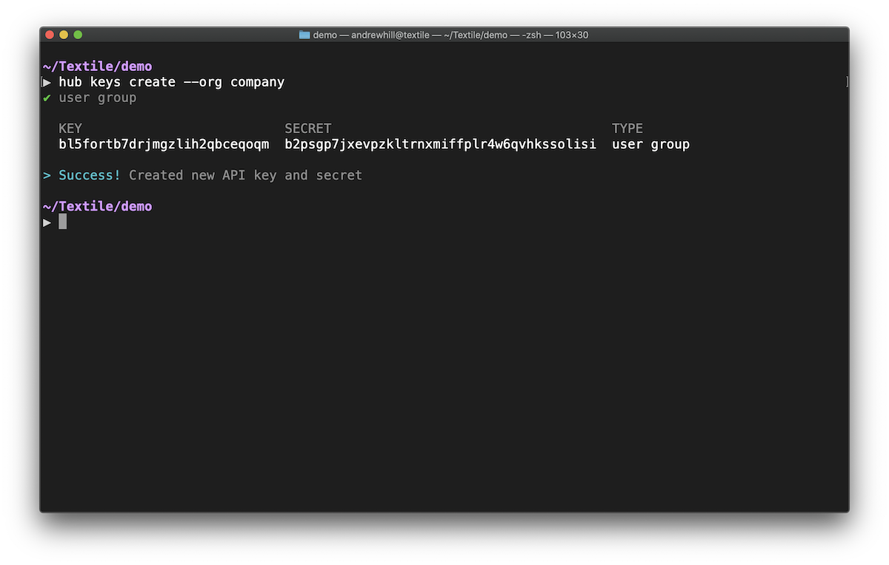

# Getting Started

Use the Hub to help scale your applications on IPFS. The Hub APIs are available for your apps and your app users. You can use the Hub APIs with a privileged [Account API Key](#account-key) or with a [User Group Key](#user-group-key). Both have the ability to push new data to Buckets, persist ThreadDB data, and relay ThreadDB updates (among other things). Attaching the Hub to your users' data will allow you to deliver high-quality user-experiences. In order to make this as straightforward as possible, you need to understand a few additional basic concepts.

<center>

|                      |     Owner    |       CLI      |   Account Key  |    User Group Key    |
|----------------------|:------------:|:--------------:|:--------------:|:--------------:|
| Developer Threads    |   Hub Login  | create, access | create, access |                |
| Developer Buckets    |   Hub Login  | create, access | create, access |                |
| Organization Threads |   Hub Login  | create, access | create, access |                |
| Organization Buckets |   Hub Login  | create, access | create, access |                |
| User Threads     | PKI Identity |                |                | create, access |
| User Buckets     | PKI Identity |                |                | create, access |

</center>

The above table gives an overview of the different roles that can create or manage Threads and Buckets. In short, there are developer identities on the Hub and then a developer's app users represented as [private-key identities](#identity) originating in their app. Each can use resources on the Hub, and below we will walk through the details of each.

## API Access



### Account Key

Account keys provide direct access to developer and org account Buckets and Threads. Account keys make it possible to build apps that have full access to developer or organization Buckets. You can use account keys to integrate your Buckets into CI, dashboards, team messaging integration, etc. To create a new Account Key using `hub key create` and selecting the `account` option.

_[See CLI options](../hub/cli/hub_keys.md)_

### User Group Key

User groups are non-admin groups of users (e.g. app users or beta users) that you want to provide restricted access to your Hub APIs. For each user group you want, you create a single _user group key_ that will be used by all members of the group to access your API endpoint (developer or organization). For example, your app can create Buckets and Threads on behalf of your user that they sign on device with their own identity.

#### Creating User Group keys

To create a new _user group key_ using `hub key create` and selecting the `user group` option. If you are buiding an app in an organization, use `hub key create --org=<name>` to link a new key to the organization not your personal account. There is currently no migration tools, so we recommend creating a new organization or using an existing organization when starting a new app (see [Organizations](../hub/accounts.md)).

Create a new `user` key using `hub key create` command line tool. After some steps to create an account, you can create the keys.

```bash
➜ hub key create # select the 'user' option
```

This should produce output similar to the following. Make note of these values, but do not share them! For a Node app, it is a good idea to use a tool such as [dotenv](https://github.com/motdotla/dotenv) to reference them in your apps, which is what we will assume below.

```bash
✔ user

  KEY                          SECRET                          TYPE  
  bqab5csdh...no6jjezox4       bm2tk476yivwlw...3a4cayll7ztha  user  

> Success! Created new API key and secret
```

#### Non-signing User Group keys

You can use insecure keys with the API by creating non-signing keys. These keys are meant to use during development only. Read the tutorial on [development mode](../tutorials/hub/development-mode.md) to use these keys.

#### Updating User Group keys

You can replace your keys in your app at any time and the user will still have access to their Threads and Buckets as long as the key is connected to the same developer or organization. If you fully delete your account or organization, data replicated on IPFS through the _user group key_ will **also be removed**. So if you remove your account, we highly encourage you to replicate the data on an external IPFS node, provide tools for your users to export or replicate their own account data, or host external Thread Services to migrate your user Thread replication to.

Also see [Identity tutorial](../tutorials/hub/libp2p-identities.md) and how to use identity providers such as 3Box with user group keys.

_[See CLI commands](../hub/cli/hub_keys.md)_

## App APIs

### Buckets

[Buckets](../buckets/index.md) provide S3-like data storage on IPFS. Just as you can create Buckets with the [Hub CLI](../hub/cli/hub.md), you can create Buckets using JavaScript with [js-hub](#libraries).

The [js-hub](#libraries) library allows you to create and edit Buckets owned by you or your organization using an [account key](#account-key). Alternatively, you can use Buckets to store your user's data using a [user group key](#user-group-key).

### ThreadDB

[ThreadDB](../threads/index.md) is a mongo-like database that runs on IPFS. You can use it in combination with [js-hub](#libraries) to add replication and relay to your user's databases. When combined, `js-threads` and `js-hub` allow you to embed private, p2p databases in your app that use remote IPFS peers for pinning and remote ThreadDB peers to relay updates to all parties. This configuration will help you scale your app and offer the highest quality experience to your users.

## Identity and API access

### Generic identity model

Identities also provide a way for developers to allocate resources (i.e., storage) for a particular user, and in fact, is a key component in ensuring that a user *controls their own data*. Hub, Buckets, and ThreadDB APIs are flexible when it comes to user identity, allowing you to handle user identities (for access control and security/encryption) in the best way for your app and your users. In order to handle *multiple* peers collaborating on a single database, as well as the ability to handle storage *on behalf* of a user, Hub APIs expect a simple Identity interface for singing and validating updates.

You can create a basic identity for our user in a JavaScript application using the `Libp2pCryptoIdentity` object. In practice, you might have your own identity provider, or you might want to use a hierarchical key/wallet or mnemonic phrase to help store a users keys for them. Whatever you decide, Textile's generic identity interface should be able to support it.

```typescript
import { Libp2pCryptoIdentity } from '@textile/threads-core'

async function example () {
   const identity = await Libp2pCryptoIdentity.fromRandom() // Random identity
   return identity
}
```

Read more about Identity in the [identity tutorial](../tutorials/hub/libp2p-identities.md).

### Data Ownership

The databases and buckets you create over the APIs are owned in one of three ways.

1. Developer owned. If you use an account key with the Buckets or ThreadDB APIs, the data will be linked directly to your account.
2. Org owned. If you create an account key using the --org flag, the Buckets and Threads will be linked to the organization.
3. User owned. If you create a user group key, Textile allows your app to provision new Buckets and Threads on behalf of your users. This data will be signed and owned by your end-users and only accessible to them.

API keys add a lot of flexibility in how you use resources on the Hub. A developer is able to access Hub resources as themselves (i.e., the developer), with all the administrative capabilities that entails, or as users of their app, which are sandboxed but can create Threads (and Buckets) of their own *within* that user-scoped sandbox.

This is a very powerful framework for accessing and allocating developer resources on behalf of users, while still providing the control and quality user-experience that apps built on Threads should provide.

### User authorization

This step is only necessary if you are using production (signing required) API keys. If you are in [development mode](../tutorials/hub/development-mode.md), you don't need to do this step.

Authorizing the user with your _user group key_ and Secret will allow the user to store threads and buckets using your developer resources on the Hub. If you are running in development mode and created a key that doesn't require signing.

Read more about setting up authentication and authorization in [production mode](../tutorials/hub/production-auth.md).

## Libraries

You can find all remote Thread and Bucket APIs in the `textile` libraries below. These libraries are meant to work in combination with the `threads` libraries when you want to create and manage Threads database in your app. 

Here are the libraries you will find useful to start building today.

|                         | ThreadDB           | Threads APIs & Buckets      |
|-------------------------|:---------------------:|:-------------------:|
| Browser, React Native, & NodeJS | [js-threads](https://textileio.github.io/js-threads) | [js-hub](https://textileio.github.io/js-hub) |
| Golang Libraries        | [go-threads](https://godoc.org/github.com/textileio/go-threads/api/client)          | |
| Command-line | _thread-shell (coming)_       | [Hub CLI](../hub/cli/hub.md)         |