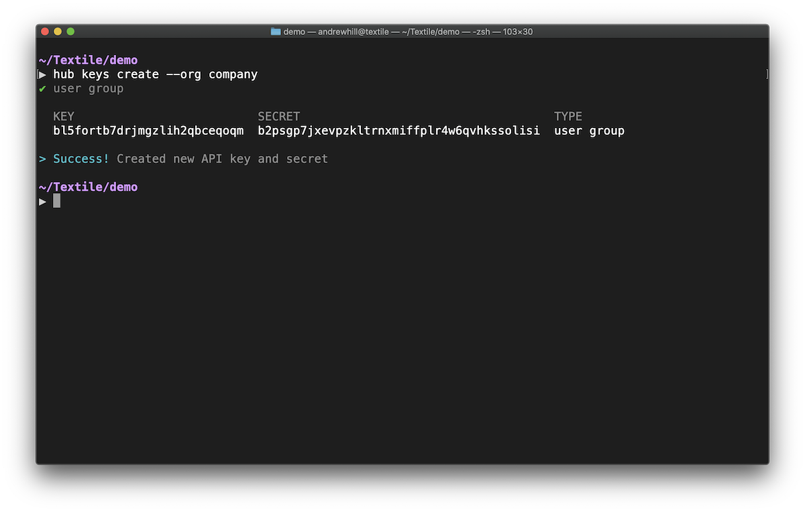

# Getting Started

In this section, we'll walk through the basic concepts useful when building your app to use the Hub. We'll break the discussion into a few key parts, shown in the table of contents to the right.

## Available APIs

### Buckets

[Buckets](../buckets/index.md) provide S3-like data storage on IPFS. Just as you can create Buckets with the [Hub CLI](../hub/cli/hub.md), you can create Buckets using JavaScript with [js-hub](#libraries).

The [js-hub](#libraries) library allows you to create and edit Buckets owned by you or your organization using an [account key](#account-key). Alternatively, you can use Buckets to store your user's data using a [user group key](#user-group-key).

### ThreadDB

[ThreadDB](../threads/index.md) is a mongo-like database that runs on IPFS. You can use it in combination with [js-hub](#libraries) to add replication and relay to your user's databases. When combined, `js-threads` and `js-hub` allow you to embed private, p2p databases in your app that use remote IPFS peers for pinning and remote ThreadDB peers to relay updates to all parties. This configuration will help you scale your app and offer the highest quality experience to your users.

## API Access

When building apps or services, you can access the Hub APIs to push new buckets, relay or persist threads, ensure data from your app is available on the IPFS network, and more. You can access those APIs through the use of API keys.

### Roles

There are only three roles on the Hub, the developer, a developer's orgs, and the user.

* *Developers*: You. You are a primary account owner. You can create new API keys, create and join new Organizations, and access admin APIs. You can create your own Buckets and Threads. You can use the CLI with your account do all the mentioned.
* *Organizations*: You and your collaborators. Members can share admin control of API keys. Members can share access to and synchronize Bucket state across all members. Referenced through docs as simply, `Org`.
* *Users*: Accounts generated by your apps using a `User Group` API key. Your app can create Threads and Buckets owned by these users. These users can then add or remove content from those assets based on their identity. They cannot use the CLI and cannot create new API keys.

### API Keys

The Hub has two forms of API key, an *Account Key* and a *User Group Key*.

* **Account Keys** can grant access to the developers own resources (e.g. Buckets you create using the command-line interface). If Account Keys are generated with the `-o` (organization) flag, they will grant access to that organization's resources. Example uses include, integrating your Buckets into CI, dashboards, team messaging integration, etc.
* **User Group Keys** only grant access to new resources for new identities, not those of the developer. User group keys can be used in an application to allow app users to leverage Hub APIs (e.g. create and push new buckets). User group keys do not have permission to access the developer or organization resources, but threads and buckets created using these keys _are counted against API limits_.

### Access Summary

Below is a brief summary of the Hub resources you may create and access with each key type. 

<center>

| Resource example    |     Owner    |       CLI      |   Required Key  |
|----------------------|:------------:|:--------------:|:--------------:|
| Developer Threads    |   Hub Developer  | create, access | Account Key |
| Developer Buckets    |   Hub Developer  | create, access | Account Key |
| Organization Threads |   Hub Developer(s)  | create, access | Account Key |
| Organization Buckets |   Hub Developer(s)  | create, access | Account Key |
| User Threads     | App User |                |   User Group Key  |
| User Buckets     | App User |                |   User Group Key  |

</center>

### Creating Keys

#### Account Key

To create a new Account Key using `hub key create` and selecting the `account` option.



_[See CLI options](../hub/cli/hub_keys.md)_

#### User Group Key

To create a new _user group key_ using `hub key create` and selecting the `user group` option. If you are building an app in an organization, use `HUB_ORG=<org name> hub key create` to link a new key to the organization not your personal account. There is currently no migration tools, so we recommend creating a new organization or using an existing organization when starting a new app (see [Organizations](../hub/accounts.md)).

```bash
➜ hub key create # select the 'user' option

✔ user

  KEY                          SECRET                          TYPE  
  bqab5csdh...no6jjezox4       bm2tk476yivwlw...3a4cayll7ztha  user  

> Success! Created new API key and secret
```

#### Non-signing User Group keys

You can use insecure keys with the API by creating non-signing keys. These keys are meant to use during development only. Read the tutorial on [development mode](../tutorials/hub/development-mode.md) to use these keys.

#### Updating User Group keys

You can replace your keys in your app at any time and the user will still have access to their Threads and Buckets as long as the key is connected to the same developer or organization.

_[See CLI commands](../hub/cli/hub_keys.md)_

## Identity and API access

### Generic identity model

Identities also provide a way for developers to allocate resources (i.e., storage) for a particular user, and in fact, is a key component in ensuring that a user *controls their own data*. Hub, Buckets, and ThreadDB APIs are flexible when it comes to user identity, allowing you to handle user identities (for access control and security/encryption) in the best way for your app and your users. In order to handle *multiple* peers collaborating on a single database, as well as the ability to handle storage *on behalf* of a user, Hub APIs expect a simple Identity interface for singing and validating updates.

You can create a basic identity for our user in a JavaScript application using the `PrivateKey` object available in the Hub library. In practice, you might have your own identity provider, or you might want to use a hierarchical key/wallet or mnemonic phrase to help store a users keys for them. Whatever you decide, Textile's generic identity interface should be able to support it.

```typescript
import { PrivateKey } from '@textile/hub'

async function example () {
   const identity = await PrivateKey.fromRandom() // Random identity
   return identity
}
```

Read more about Identity in the [identity tutorial](../tutorials/hub/pki-identities.md).

### Data Ownership

The databases and buckets you create over the APIs are owned in one of three ways.

1. Developer owned. If you use an account key with the Buckets or ThreadDB APIs, the data will be linked directly to your account.
2. Org owned. If you create an account key using the `HUB_ORG` environmental variable, the Buckets and Threads will be linked to the organization.
3. User owned. If you create a user group key, Textile allows your app to provision new Buckets and Threads on behalf of your users. This data will be signed and owned by your end-users and only accessible to them.

API keys add a lot of flexibility in how you use resources on the Hub. A developer is able to access Hub resources as themselves (i.e., the developer), with all the administrative capabilities that entails, or as users of their app, which are sandboxed but can create Threads (and Buckets) of their own *within* that user-scoped sandbox.

This is a very powerful framework for accessing and allocating developer resources on behalf of users, while still providing the control and quality user-experience that apps built on Threads should provide.

### User authorization

This step is only necessary if you are using production (signing required) API keys. If you are in [development mode](../tutorials/hub/development-mode.md), you don't need to do this step.

Authorizing the user with your _user group key_ and Secret will allow the user to store threads and buckets using your developer resources on the Hub. If you are running in development mode and created a key that doesn't require signing.

Read more about setting up authentication and authorization in [production mode](../tutorials/hub/production-auth.md).

## Libraries

You can find all remote Thread and Bucket APIs in the `textile` libraries below. These libraries are meant to work in combination with the `threads` libraries when you want to create and manage Threads database in your app. 

Here are the libraries you will find useful to start building today.

|                         | Library     |
|-------------------------|:---------------------:|
| Browser, React Native, & NodeJS | [js-hub](https://textileio.github.io/js-hub) | [js-hub](https://textileio.github.io/js-hub) |
| Golang Libraries        | [go-threads](https://godoc.org/github.com/textileio/go-threads/api/client),<br/> [buckets](https://godoc.org/github.com/textileio/textile/api/buckets)          |
| Command-line | [Hub CLI](../hub/cli/hub.md),<br/> _thread-shell (coming)_       | 