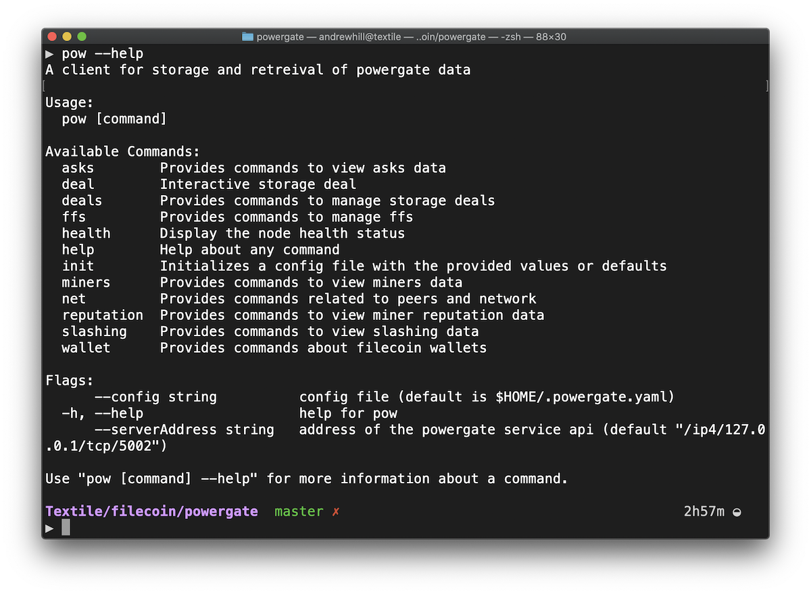
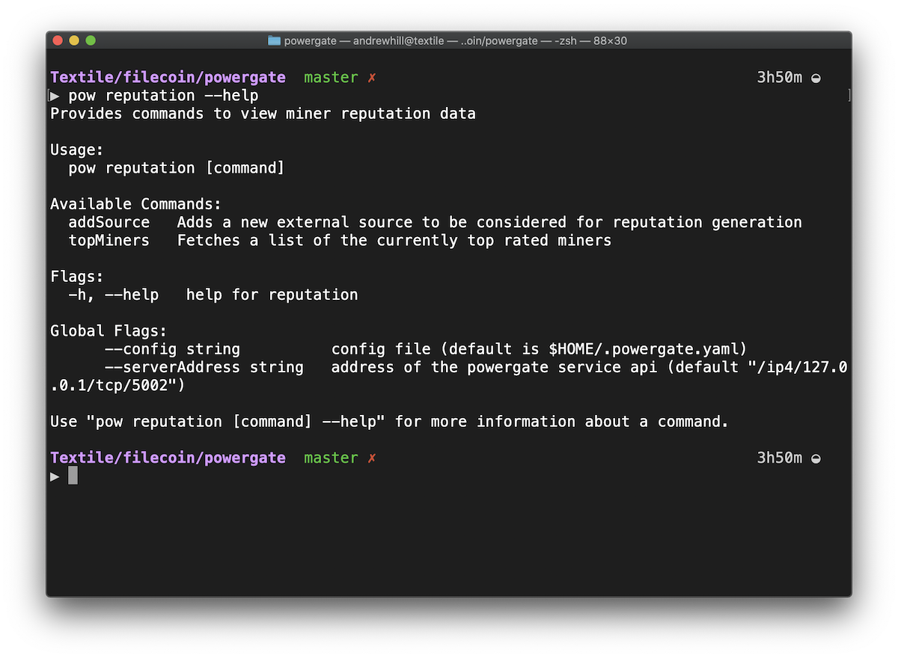

# Introduction to the Powergate

The Powergate is an API driven solution for deploying multitiered storage across Filecoin and IPFS. Persistent storage on Filecoin allows rich storage configuration for data such as replication factor, miner selection, deal renewal, and repair. Network available storage is configurable and provided through a connected IPFS peer or pinning network.

## Overview

Powergate is a collection of libraries, modules, and configurations that can used independently, and composed together to integrate Filecoin into your application or storage system. The Powergate is designed to manage one or many Filecoin wallet addresses. Each address in Powergate can be independently managed through the [FFS API](#api) (or grouped together into a single _FFS instance_).

Some benefits of using the Powergate include,

- Make data stored on Filecoin available on the IPFS network easily.
- Handle long-term storage deal management, including automated renew and repair.
- Make use of network indices to improve miner selection and deal creation.
- Manage Filecoin wallet addresses for one or many users.
- Much more!

### Libraries


<div class="txtl-options">
  <a href="https://github.com/textileio/powergate/" class="box" target="_blank">
    <h5>Powergate</h5>
    <p>Multitiered file storage API built on Filecoin and IPFS.</p>
  </a>
  <span class="box-space"> </span>
  <a href="https://github.com/textileio/js-powergate-client" class="box" target="_blank">
    <h5>Powergate JS Client</h5>
    <p>Typesctipt/Javascript client for Textile's Powergate .</p>
  </a>
  <span class="box-space"> </span>
  <a href="/powergate/devnet" class="box">
    <h5>Lotus Devnet</h5>
    <p>A fast development node for working with Filecoin APIs.</p>
  </a>
</div>

## Getting started

### Command-line Interface

The Powergate includes the full set of features through the binary command-line interface.

**Install the CLI**

You can build and install the Powergate CLI from the [Powergate Repo](https://github.com/textileio/powergate).

```bash
git clone git@github.com:textileio/powergate.git
cd powergate
make build
```

**Using the CLI**

Powergate CLI commands are just `pow`.




### Multi-tired storage

The workhorse of APIs in the Powergate is called, the [FFS](ffs.md) (Filecoin File System). This module provides a multi-tiered file storage API built on Filecoin and IPFS. Storing data on IPFS and Filecoin is as easy as expressing your desired configuration for storing a Cid.

The FFS is where the Powergate handles Filecoin wallet addresses, long-term deal management, and connecting Filecoin to IPFS. Access to the FFS is enabled through a basic token, allowing you to create many FFS Instances, and map Powergate API access to user(s) in your system.

[Read about the FFS here](ffs.md).

### Network Indices

**Indices**

A running Powergate deployment will collect a number of useful indices about the network. Some of the data collected in these indices are used by the FFS to streamline miner selection when creating new deals. You can use the indices directly to build other features into your own system.

- **Miners index**. Provides processed data regarding registered miners (on-chain and off-chain), such as: total miner power, relative power, online status, geolocation, and more!
- **Ask index**. Provides a fast-retrieval up to date snapshot of miner's asking prices for data storage.
- **Slashing index**. Provides history data about miners faults while proving their storage on-chain.

**Reputation Module**

Built on top of the previous indexes, a Reputation module constructs a weighted-scoring system that allows to sort miners considering multiple on-chain and off-chain data, such as: compared price to the median of the market, low storage-fault history, power on network, and external sources (soon!).



### Powergate APIs

The Powergate APIs are available as gRPC endpoints. There are three ways to get familiar with the broad set of APIs available to start using on the Powergate.

* **Explore the CLI**. The CLI runs on the Powergate API, so in general, anything you can do in the CLI you can also do over the API.
* **Use the JS Client**. We have provided an easy to use [JavaScript client for the Powergate APIs](https://github.com/textileio/js-powergate-client).
* **Browse the Protocols**. The API is typed with Protocol Buffers and you can quickly view all capabilities by looking at the `.proto` files in the [Powergate repo](https://github.com/textileio/powergate). The best place to start is the [FFS API](https://github.com/textileio/powergate/blob/master/ffs/rpc/rpc.proto#L310).

### Additional Tools

The Powergate comes packed with a number of additional tools that will be useful to you as you integrate it into your system.

- Prometheus. The backend for metrics processing.
- Grafana. Providing metrics dashboard.
- cAdvisor. Providing container metrics.
- Lotus. A Lotus node running on the current Testnet.
- IPFS. A full IPFS node running to back Powergate FFS.

### Running the Powergate

You can run the Powergate on the Filecoin testnet or using the embedded devnet. We recommend starting out with the devnet as you'll get access to the full set of APIs and capabilities without having to start syncing the network right away.

#### Devnet

The devnet provides a fast, fully functional, embedded Filecoin network that can be used for testing, building, or running continuous integratin. [Read more about running the Powergate on devnet or running the devnet with a standalone Lotus node](devnet.md).

#### Testnet

Once you are ready to start using the Powergate with the Filecoin Testnet, [read the production setup instructions](https://github.com/textileio/powergate/#production-setup).

#### Mainnet

When Filecoin Mainnet launches, we'll provide setup steps like the Testnet steps above.

## Learn more

#### Walk-through Video

<center>
<iframe width="640" height="355" src="https://www.youtube.com/embed/aiOTSkz_6aY" frameborder="0" allowfullscreen ng-show="showvideo"></iframe>
</center>

In the above presentation, we'll give a high-level overview of how the Powergate fits into the Filecoin and IPFS networks and a detailed walk-through of system components.

#### Running System Video

<center><iframe src="https://player.vimeo.com/video/411596107?quality=2k" width="640" height="355" frameborder="0" allow="autoplay; fullscreen" allowfullscreen></iframe></center>

The above video shows the Powergate startup including IPFS and Lotus nodes. Next, the admin uses the Powergate CLI to create a deal on the Filecoin network.

## Keep up-to-date

Follow the project [on our blog](https://blog.textile.io/tag/filecoin/) and on our [GitHub repo](https://github.com/textileio/powergate) and give us your feedback.

<br/>