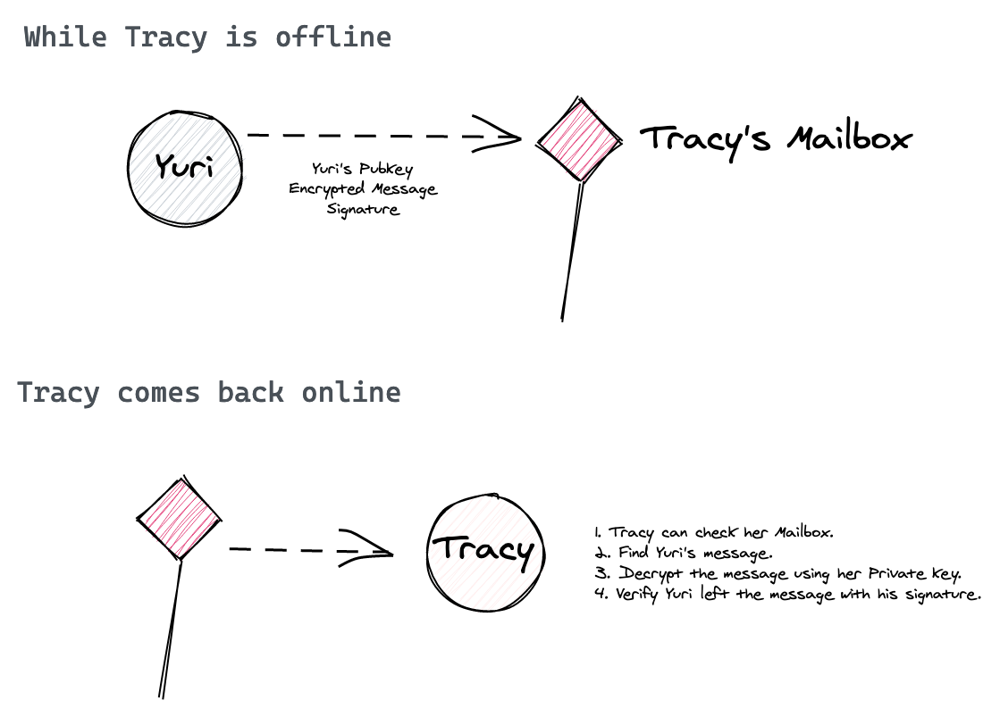

# User Mailboxes

The Hub user APIs provide mechanisms for sending and receiving messages between Hub users. Mailboxes are built on ThreadDB.

Visit the [GoDoc](https://pkg.go.dev/github.com/textileio/textile/mail/local?tab=doc) or [JavaScript Users doc](https://textileio.github.io/js-hub/docs/hub.users) for a complete list of methods and more usage descriptions.

## Mailbox overview

User Mailboxes provide an encrypted endpoint where encrypted messages can be left for users when they are offline. User mailboxes are designed to be used with private key based identities where each user will privately encrypt messages for recipients based on their public key.

!!!info
    You can read more about creating basic PKI identities in our [tutorial](./../tutorials/hub/pki-identities.md).

A common challenge app developers will face is how to exchange small, private information from one user to another. Take for example, using [Threads](../threads/index.md) to handle chat messages between users. Chat is a great use for Threads, but faces an initial challenge:

**Challenge**

> How do you send Thread invite details from one user to another, before the thread exists?

**Solution**

> User mailboxes!

Mailboxes allow one user of your app to encrypt and leave private messages or data for another user. Mailboxes are always online, so the user creating the message can do it immediately and the recipient can find it the next time they use your app.

### Sending messages

To send messages, the sender only needs to know the recipients public key and be able to encrypt their message with that public key. 

1. Your app creates a new user using their identity and your Hub API key.
2. Your app user authors a new message for a contact, based on the remote contact's public key.
3. Your app user encrypts the message using the remote users public key (encyption is handled by Hub library).
4. You app sends the message to the remote user's inbox

### Receiving

To receive messages, a user simply needs to check their inbox and decrypt any messages using their private key.

1. You app user checks their Hub inbox using your API key.
2. Your user can pull any available messages (latest or using simple filters).
3. Any message body will be encrypted, so will require to decrypt the message using their private key.
4. User can then read and verify the message came from the recipient.

### Creating mailboxes

A user's mailbox needs to be initiated by them (through your app) before other users can begin sending them messages. We suggest you do this as part of the onboarding steps in your app. You can read about this creation process in [Go here](https://github.com/textileio/textile#creating-a-mailbox) and in [JavaScript here](https://textileio.github.io/js-hub/docs/hub.users).

### Using inboxes and sentboxes

After a mailbox is set up you can now add the following methods to your application:

* Get existing mailbox. [Golang](https://github.com/textileio/textile#getting-an-existing-mailbox) [JavaScript](https://textileio.github.io/js-hub/docs/hub.users.getmailboxid).
* Send messages. [Golang](https://github.com/textileio/textile#sending-a-message) [JavaScript](https://textileio.github.io/js-hub/docs/hub.users.sendmessage).
* Watch inbox. [Golang](https://github.com/textileio/textile#watching-for-new-messages) [JavaScript](https://textileio.github.io/js-hub/docs/hub.users.watchinbox).

And more!

### Message encryption and signing

Messages are encypted using the recipient's ed2559 public key, meaning that the body of the message can only be read by the private key holder. 

Read more about the identity utilities in the [identity tutorial](../tutorials/hub/pki-identities.md).

Some methods you will find useful include:

* [PrivateKey Identities](https://textileio.github.io/js-hub/docs/hub.privatekey)
* [Encryption by PublicKey](https://textileio.github.io/js-hub/docs/hub.publickey.encrypt)
* [Decrypt by PrivateKey](https://textileio.github.io/js-hub/docs/hub.privatekey.decrypt)
* [Sign by PrivateKey](https://textileio.github.io/js-hub/docs/hub.privatekey.sign)

## Try it out

  <a href="https://github.com/textileio/js-examples/tree/master/user-mailbox-setup" class="box" target="_blank">
    <h5>Mailbox example</h5>
    
A single-user example sending message to an inbox.

  </a>

